# contourfcmap.m: filled contour plot with precise colormap

[](https://www.mathworks.com/matlabcentral/fileexchange/29638-contourfcmap-filled-contour-plot-with-precise-colormap)

Author: Kelly Kearney


This repository includes the code for the `contourfcmap.m` Matlab function, along with all dependent functions required to run it.


This function creates a shaded contour map, similar to that created by the contourf function.  However, the relationship between a contourf plot and its colormap (i.e. exactly which color corresponds to each contour interval), can often be confusing and inconsistent.  This function instead allows the user to specify exactly which colors to use in each interval, and also to choose colors for regions that exceed the contour line limits.


## Contents

            
- Getting started        
- Syntax        
- Description        
- Examples        
- The algorithms behind contourfcmap        
- Contributions

## Getting started


**Prerequisites**


This function requires Matlab R14 or later.


**Downloading and installation**


This code can be downloaded from [Github](https://github.com/kakearney/contourfcmap-pkg/) or the [MatlabCentral File Exchange](http://www.mathworks.com/matlabcentral/fileexchange/29638).  The File Exchange entry is updated daily from the GitHub repository.


**Matlab Search Path**


The following folders need to be added to your Matlab Search path (via `addpath`, `pathtool`, etc.):


```matlab
contourfcmap-pkg/FEX-function_handle
contourfcmap-pkg/arclength
contourfcmap-pkg/contourcs
contourfcmap-pkg/contourfcmap
contourfcmap-pkg/distance2curve
contourfcmap-pkg/fillnan
contourfcmap-pkg/interparc
contourfcmap-pkg/minmax
contourfcmap-pkg/multiplepolyint
contourfcmap-pkg/parsepv
contourfcmap-pkg/pcolorbar
```


## Syntax


```matlab
contourfcmap(x,y,z,clev,cmap)
contourfcmap(x,y,z,clev,cmap, Name, Value)
h = contourfcmap(...)
```


## Description


`contourfcmap(x,y,z,clev,cmap)` plots a filled contour plot of the matrix `z` with coordinates `x` and `y`.  `z` must be at least a 2x2 matrix; `x` and `y` can either be matrices defining the grid for `z`, or vectors that correspond to the column and row coordinates, respectively. `clev` is an n x 1 vector defining the contour line levels, and `cmap` is an n-1 x 1 colormap array defining the colors to be used between each of the contour levels.


`contourfcmap(x,y,z,clev,cmap, 'lo', lo)` indicates the color value `lo` (a 1 x 3 RGB array) to be used for any region with data lower than the first contour level. Default is white.


`contourfcmap(x,y,z,clev,cmap, 'hi', hi)` indicates the color value `hi` (a 1 x 3 RGB array) to be used for any region with data higher than the last contour level.  Default is white.


`contourfcmap(x,y,z,clev,cmap, 'method', method)` allows you to switch between the 'recolor' and 'calccontour' algorithms (see below for details).  Default is 'recolor' (though I now recommend 'calccontour' for R2017b or later).


`contourfcmap(x,y,z,clev,cmap, 'cbarloc', cbarloc)` adds a psuedo-colorbar using the colorbar location indicator `cbarloc`.  Default is no colorbar.


`contourfcmap(x,y,z,clev,cmap, 'evencb', evencb)` indicates whether to space the colors on the colorbar evenly (evencb = true) or to size them according to the clev values (evencb = false).  Default is false.


`h = contourfcmap(...)` returns a structure `h` whose fields hold the colorbar axis handle structure (`h.cb`, see `pcolorbar.m` for details), contour object (`h.h`), contour matrix (`h.c`), and patch object (`h.p`).


## Examples


First we'll plot a contourf plot using the standard Matlab functions. Without labeling the contour lines, it's difficult to tell which values in the colorbar correspond to the color intervals in the contourf plot.


```matlab
count = 0;

% Data

[x,y] = meshgrid(linspace(0,1,100));
z = peaks(100);
clev = [-5 -3 -2:.5:2 3 5];

% Set up axes

h.fig = figure('color', 'w');
h.ax(1) = axes('position', [0.05  0.25 0.425 0.5]);
h.ax(2) = axes('position', [0.525 0.25 0.425 0.5]);

% Plot

axes(h.ax(1));
contourf(x,y,z,clev);
cb = colorbar('eastoutside');
colormap(h.ax(1), jet);
title(h.ax(1), 'contourf');
```


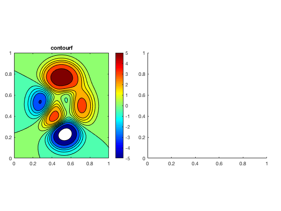

Using contourfcmap, we can set the colors explictly, so it's much easier to tell exactly which color corresponds to which value.


```matlab
axes(h.ax(2));
hc = contourfcmap(x,y,z,clev,jet(12), ...
     'lo', [.8 .8 .8], ...
     'hi', [.2 .2 .2], ...
     'cbarloc', 'eastoutside', ...
     'method', 'calccontour');
title(h.ax(2), 'contourfcmap');
```


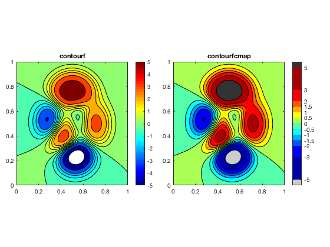

If you prefer, you can set the colorbar to show the contour intervals evenly-spaced, even if the values aren't.


```matlab
delete(hc.cb.cb);
delete(hc.cb.ax);
cla;

hc = contourfcmap(x,y,z,clev,jet(12), ...
     'lo', [.8 .8 .8], ...
     'hi', [.2 .2 .2], ...
     'cbarloc', 'eastoutside', ...
     'method', 'calccontour', ...
     'evencb', true);
title(h.ax(2), 'contourfcmap');
```


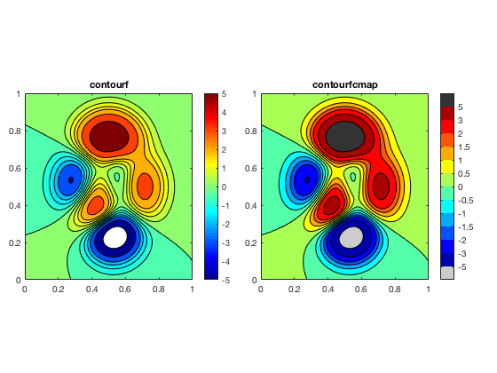


## The algorithms behind contourfcmap


This function began its life as a very simple function back in 2010.  At that time, it was just a wrapper around `contourf`.  A contour object in Maltab circa 2010 was a combination of some lines (the contour lines) and some patches (the shaded regions), and my function just looped over those patches and assigned new colors to their CData properties.


Then the 2014b release came along, and with it, a complete overhaul of Matlab's graphics objects.  Under these new second-generation handle graphics (i.e. HG2), contour objects became more complex.  They now were composed of TriangleStrips, a low-level, mostly-undocumented graphics object that really wasn't designed to be tampered with.


I updated my function to repeat its old processes, looping over the contours and changing the colors.  But those color changes weren't very permanent. Changing the colormap, adding a colorbar, and most frustratingly, printing figures to file (using anything that relies on the print command, including print, saveas, export_fig, etc) undoes it. My function was pretty useless if I couldn't get changes to stick.


So in 2014, I introduced a new algorithm to contourfcmap, the 'calccontour' method.  This version still uses the contour function to do the heavy lifting of the contouring calculations (contouring is hard!), but then tries to draw the shaded region using patches, as in the old HG1 version.  I originally considered this just a hacky stand-in until I could get recoloring to stick.  It worked pretty well for simple datasets, but fell apart for more complicated ones, especially those involving NaNs and non-cartesian grids.  But the recoloring option reset issue has persisted through newer releases of Matlab (actually, it's gotten worse).


I've now (March 2018) just completed an overhaul of the calccontour option.  This update may break back-compatibility with older code that uses contourfcmap, since I've modified some of the output variables (though it should still support all the older syntax in terms of input variables). I've expanded the code to be much more robust to non-cartesian grids and NaNs, and with the introduction of polyshape objects, the polygon calculations no longer require the Mapping Toolbox.  Though still a bit slow to plot, this algorithm also fixes a few issues with the way Matlab colors (or rather, doesn't color) lower-than-lowest-contour regions.  And finally, I've altered the colorbar code to rely on my pcolorbar function, which provides for more robust resizing (similar to a real colorbar) when one makes changes to the axis.


This example walks you through my thought process with this algorithm, and some of the issues with contourf that I'm trying to address.


We'll start with the peaks data:


```matlab
close all;
figure;

[x,y,z] = peaks;

hs = scatter(x(:),y(:),10,z(:),'filled');
hcb = colorbar;
set(gca, 'clim', [-15 15], 'xlim', [-4.5 4.5], 'ylim', [-4.5 4.5]);
hold on;
```


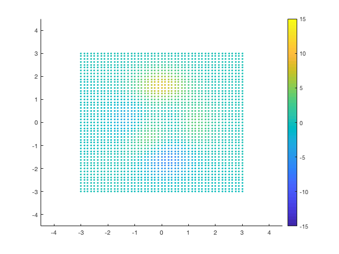

Most of Matlab's example contour data assumes a cartesian grid (i.e. data aligned along the x- and y-axes, like an image).  But it doesn't need to be... any structured grid will work.  Let's add some skew and rotation, to make sure this example covers the more complicated cases:


```matlab
y = y + sin(x);
th = pi/3;
R = [cos(th) -sin(th); sin(th) cos(th)];
xy = R * [x(:) y(:)]';
x = reshape(xy(1,:), size(x));
y = reshape(xy(2,:), size(y));

delete(hs);
hs = scatter(x(:),y(:),10,z(:),'filled');
```


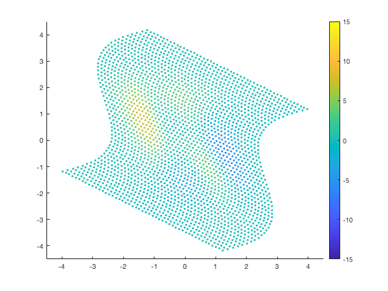

Contour data can also include NaNs.  Sometimes these represent a missing data point or two.  But they can also occur in bigger blocks; for example, a map of ocean data might represent land with NaNs.  We'll add both enclosed (surrounded by data) and unenclosed (connecting to side of grid) NaNs, and make sure we have some extra data islands of high and low data in there too (you'll see why in a bit):


```matlab
z(z &lt; 0.2 &amp; z > 0) = NaN;
z(1:3,1:3) = -15;
z(end-3:end,end-3:end) = 15;
z(25:30, 1:2) = -15;

delete(hs);
hs = scatter(x(:),y(:),10,z(:),'filled');
```


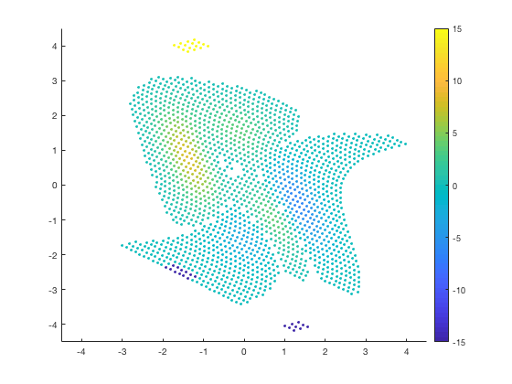

Let's say we want to plot some contours, with specific colors between each interval.  We can show this by plotting a scatter plot of the discretized values:


```matlab
% Discretize

bin = discretize(z, clev);
bin(z &lt; clev(1)) = 0;
bin(z > clev(end)) = length(clev)+1;

% Colors

clev = [-5 -3 -2:.5:2 3 5];
cmap = [...
      0.65098      0.80784       0.8902
      0.12157      0.47059      0.70588
      0.69804      0.87451      0.54118
          0.2      0.62745      0.17255
      0.98431      0.60392          0.6
       0.8902      0.10196       0.1098
      0.99216      0.74902      0.43529
            1      0.49804            0
      0.79216      0.69804      0.83922
      0.41569      0.23922      0.60392
            1            1          0.6
      0.69412      0.34902      0.15686];
lo = [0.57255      0.58431      0.56863];
hi = [0.84706      0.86275      0.83922];

% Plot

delete(hs);
hs = scatter(x(:),y(:),10,bin(:),'filled');
colormap([lo; cmap; hi]);
set(gca, 'clim', [-0.5 length(clev)+0.5]);

tklabel = ['lo' ...
    arrayfun(@(a,b) sprintf('%.1f - %.1f',a,b), ...
             clev(1:end-1), clev(2:end), 'uni', 0) ...
    'hi'];
set(hcb, 'ticks', 0:length(clev), 'ticklabels', tklabel);
```


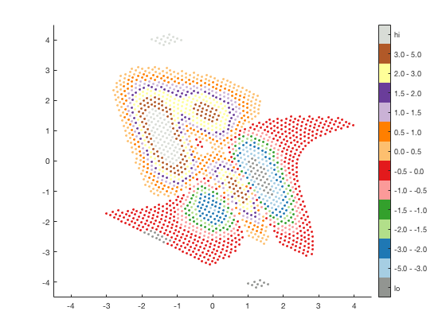

We can try to use the same discretization trick to try to get our desired filled contour plot.


```matlab
delete(hs);
[cc, hc] = contourf(x,y,bin,0.5:1:length(clev));
```


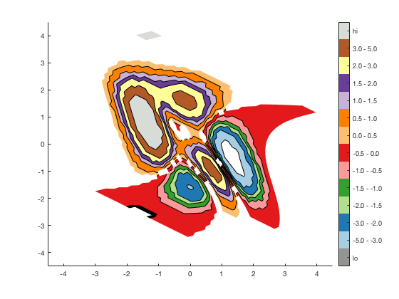

But that sacrifices the resolution of the contouring.  We can also try fiddle with the colormap, trying to get the colors to match our contour levels.  I do this via the [cptcmap](https://www.mathworks.com/matlabcentral/fileexchange/28943-color-palette-tables---cpt--for-matlab) function.


```matlab
loval = clev(1) - (clev(end)-clev(1))*0.1;
hival = clev(end) + (clev(end)-clev(1))*0.1;

ctable = [[loval clev]' [lo;cmap;hi]*255 [clev hival]' [lo;cmap;hi]*255]';
fid = fopen('cmaptemp.cpt', 'wt');
fprintf(fid, '%.2f %.0f %.0f %.0f %.2f %.0f %.0f %.0f\n', ctable);
fclose(fid);
[cmap2, lims] = cptcmap('cmaptemp');
delete('cmaptemp.cpt');

delete(hc);
[cc, hc] = contourf(x,y,z,clev);
set(gca, 'clim', lims);
colormap(cmap2);
set(hcb, 'Ticks', clev, 'TickLabelsMode', 'auto');
```


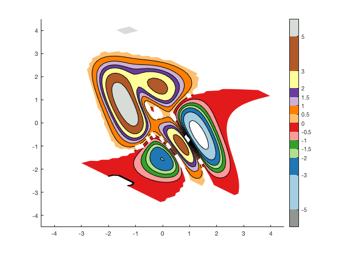

That mostly works, with a few drawbacks.  First, tweaking the colormap to look like it has uneven color intervals requires some manaul calculation. Even with cptcmap, you have to do some setup ahead of time.  Also, if we add the scatter plot on top, we'll see a few issues:


```matlab
hs = scatter(x(:), y(:), 10, z(:), 'filled');
set(hs, 'markeredgecolor', 'w');
```


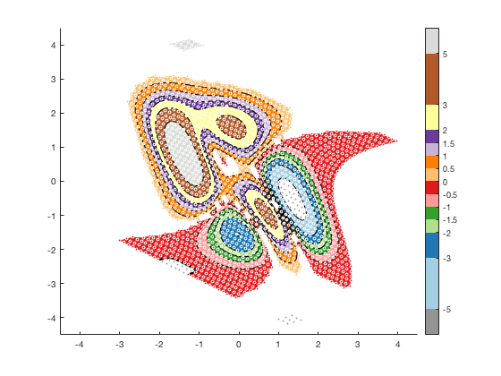

Most of the regions match the dots... except where there should be dark gray contours, i.e. where the data is lower than the specified lowest contour.  Depending on your Matlab version, when you run this, the enclosed circle on the right may or may not be shaded.  In all Matlab versions, the unenclosed areas (the bits that hit up against the wall of the grid) are unshaded.


So this is where the extra calculations in contourfcmap come in handy:


```matlab
delete(hs);
delete(hc);
delete(hcb);

h = contourfcmap(x,y,z,clev,cmap, ...
    'lo', lo, ...
    'hi', hi, ...
    'cbarloc', 'eastoutside', ...
    'method', 'calccontour');
```


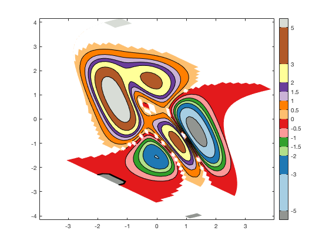

Verdict: It's slower than a simple contour plot.  But it colors the patches properly, including the lower-than-lowest-contour regions.  And there's no need to do any tricky colormap calculations.  If your application needs extremely fast rendering, and the lower-than-lowest thing isn't a problem for you,  you might be better off using one of the tricks above.  Otherwise, contourfcmap should be the easier solution.


## Contributions


Community contributions to this package are welcome!


To report bugs, please submit [an issue](https://github.com/kakearney/contourfcmap-pkg/issues) on GitHub and include:


  - your operating system
  - your version of Matlab and all relevant toolboxes (type `ver` at the Matlab command line to get this info)
  - code/data to reproduce the error or buggy behavior, and the full text of any error messages received

Please also feel free to submit enhancement requests, or to send pull requests (via GitHub) for bug fixes or new features.


I do monitor the MatlabCentral FileExchange entry for any issues raised in the comments, but would prefer to track issues on GitHub.


<sub>[Published with MATLAB R2018a]("http://www.mathworks.com/products/matlab/")</sub>
